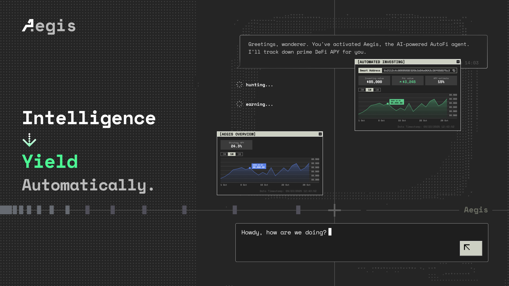

# Aegis

Aegis is an automated yield protocol (AutoFi) that identifies optimal DeFi opportunities and manages user positions autonomously.

Aegis is also an AI-powered platform where users interact through chat. The system generates contextual UI elements and charts in real-time.

Unlike other AI Agent projects, Aegis doesn't construct blockchain transactions for users or answer general knowledge questions. We believe these complicate things and increase the learning curve. Aegis focuses solely on automated yield—simple and specialized.

Simple enough for anyone. Specialized enough to trust.

Try our demo: https://demo.aegisfi.xyz